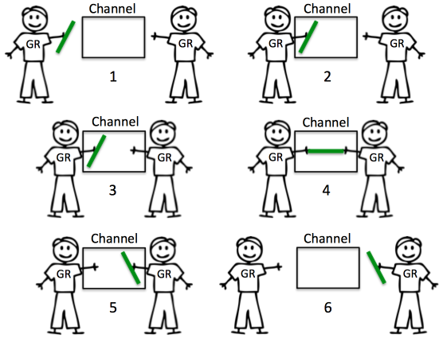

# Concurrency

## Goroutine

A goroutine is a lightweight thread managed by the Go runtime.

This is how we start a new goroutine that run `f(x, y, z)`:

```go
go f(x, y, z)
```

Example of using goroutine

```go
// File: src/goroutine/01_goroutine/main.go
package main

import (
	"fmt"
	"time"
)

func say(s string) {
	for i := 0; i < 5; i++ {
		time.Sleep(500 * time.Millisecond)
		fmt.Printf("%d %s\n", i, s)
	}
}

func main() {
	go say("goroutine")
	say("hello")
}
```

Output

```shell
$ go run main.go 
0 goroutine
0 hello
1 hello
1 goroutine
2 goroutine
2 hello
3 hello
3 goroutine
4 goroutine
4 hello
```

We can also run anonymous function in goroutine

```go
// File: src/goroutine/02_goroutine-anonymous-func/main.go
package main

import (
	"fmt"
	"time"
)

func main() {
	go func(s string) {
		for i := 0; i < 5; i++ {
			fmt.Println(s)
		}
	}("Goroutine")

	fmt.Println("Hello")
	time.Sleep(500 * time.Millisecond)
}
```

Output

```shell
$ go run main.go 
Hello
Goroutine
Goroutine
Goroutine
Goroutine
Goroutine
```

## Channel

Channels are pipes that can be used to link between `goroutine` which allow communication by passing values.

`<-` is channel operator to send and receive values.

```go
ch <- v    // Send v to channel ch.
v := <-ch  // Receive from ch, and
           // assign value to v.
```

The `<-` specifies the data direction

To create a new channel, we use `make()`

```go
ch := make(chan int)
```

By default, sends and receives **block** until the other side is ready. This allows goroutines to synchronize without explicit locks or condition variables.

This example code below sums the numbers in a slice, divide the work between two goroutine. Once both goroutines complete their calculation, it calculate the final result

```go
// File: src/channel/01_channel/main.go
package main

import "fmt"

func sum(nums []int, ch chan int) {
	sum := 0
	for _, n := range nums {
		sum += n
	}
	ch <- sum
}

func main() {
	numbers := []int{4, 2, 1, 5, 3, 10, 9, 8}
	ch := make(chan int)

	go sum(numbers[:len(numbers)/2], ch)
	go sum(numbers[len(numbers)/2:], ch)

	sum := <-ch + <-ch
	fmt.Println("Sum = ", sum)
}
```

Output:

```shell
$ go run main.go 
Sum =  42
```

### Channel Direction

We can specify channel direction when using it in function parameter.

It can be used to tell whether the channel passed to or returned from a function is meant to only send or receive values.

It is also to increase type-safety of the program

```go
ch chan<- int // can write to but cannot read from this channel
ch <-chan int // can read from but cannot write to this channel
```

For example:

```go
func channelDir1(ch <-chan int) {
	v := <-ch 	// This is allowed
	ch <- 1 	// this is not allowed
}

func channelDir2(ch chan<- int) {
	ch <- 1 	// this is allowed
	v := <-ch 	// This is not allowed
}
```

If we did not specify the direction (using `<-`) of the channel, the channel is bidirectional. Which means it can write to and read from the channel.

```go
func channelBidirectional(ch chan int) {
	v := <-ch 	// This is allowed
	ch <- 1 	// this is also allowed
}
```


### Buffered channels

By default channels are unbuffered, like the example above. That means, they will only accept sends (`chen<-`) if there's a corresponding receive (`<-chan`) ready to receive the sent value.

| Unbuffered Channel | Buffered Channel |
|--------------------|------------------|
|  |  |


To initialize a buffered channels, provide the second argument of `make` with the length of the buffer.

```go
ch := make(chan int, 10)
```

Buffered channel will block sends when the buffer is full and only receive when it's empty.

```go
// File: src/channel/02_buffered-channel/main.go
package main

import "fmt"

func main() {
	ch := make(chan int, 2)

	ch <- 1
	ch <- 2

	fmt.Println(<-ch)
	fmt.Println(<-ch)
}
```

Output:

```shell
$ go run main.go 
1
2
```

### Range and close

Channel can be closed to indicate that no more values will be sent. 

Receivers can test whether a channel has been closed using this expression:

```go
v, ok := <-ch
```

`ok` is `false` if there are no more values to receive and channel is closed.

Loop can also be used to receive from channel repeatedly using `range`, like this:

```go
for val := range channel {
	// val is value from channel
}
```

It will loop or receive value until channel is closed.

For example:

```go
// File: src/channel/03_range-close/main.go
package main

import "fmt"

func main() {
	ch := make(chan int, 10)

	go func() {
		for i := 0; i < 10; i++ {
			ch <- i
		}
		close(ch)
	}()

	for v := range ch {
		fmt.Printf("%d ", v)
	}
}
```

Output:

```shell
$ go run main.go 
0 1 2 3 4 5 6 7 8 9
```

**Note**
- Only the sender should close a channel, never the receiver. 
- Sending on a closed channel will cause a panic.
- Unlike files, channel doesn't need to be closed. Only when the receiver must be told there are no more values coming, such as to terminate a range loop.

### Select

Golang `select` statement is like the switch statement, which lets a goroutine wait on multiple communication operation

`select` will block until one of its case can run. It choose one at random if multiple case are ready.

Use a `default` case to try a send or receive without blocking, it will be selected if no other case is ready: 

```go
package main

import (
	"fmt"
	"time"
)

func main() {
	ch1 := make(chan int)
	ch2 := make(chan int)

	go func() {
		time.Sleep(200 * time.Millisecond)
		ch1 <- 10
	}()

	go func() {
		time.Sleep(200 * time.Millisecond)
		ch2 <- 20
	}()

	for received := 0; ; {
		select {
		case v := <-ch1:
			fmt.Println("Receive from ch1 = ", v)
			received++
		case <-ch2:
			fmt.Println("Receive from ch2, don't need the value")
			received++
		default:
			if received == 2 {
				return
			}
		}
	}
}
```

Output

```shell
$ go run main.go 
Receive from ch2, don't need the value
Receive from ch1 =  10	
```

## Synchronization

### Mutex

Mutex or *mutual exclusion* can be used to safely access data across multiple goroutines to avoid conflicts

Go provides mutual exclusion with `sync.Mutex`. 

Two method will be used: `Lock` and `Unlock`, called before and after a block of code to define the code to be executed in mutual exclusion.

```go
Lock()
// code to be executed in mutual exclusion
Unlock()
```

For example, execute this code to sum all the number from 0 to 999:

```go
package main

import (
	"fmt"
)

func main() {
	total = 0
	for i := 0; i < 1000; i++ {
		go func(n int) {
			total += n
		}(i)
	}

	time.Sleep(time.Second)
	fmt.Println("With goroutine: total = ", total)
}
```

The correct result is 499500, but the code above gives us incorrect result and the result is always changing. This is because there's a chance for multiple goroutine accessed `total` at the same time.

To fix it using `mutex`, we can surrounding `total += n` with `Lock` and `Unlock` like this:

```go
package main

import (
	"fmt"
	"sync"
	"time"
)

func main() {
	total := 0
	var mutex = &sync.Mutex{}

	for i := 0; i < 1000; i++ {
		go func(n int) {
			mutex.Lock()
			total += n
			mutex.Unlock()
		}(i)
	}

	time.Sleep(time.Second)
	fmt.Println(total)
}
```

If we run it, we will get:

```shell
$ go run main.go 
499500
```

### Wait groups

To wait for multiple goroutines to finish, we can use a wait group.

This example will execute several function `task` with goroutine and wait for all of them to finish.

```go
package main

import (
	"fmt"
	"sync"
	"time"
)

func task(wg *sync.WaitGroup, id int) {
	defer wg.Done()

	fmt.Println("Start task ", id)
	time.Sleep(time.Second)
	fmt.Println("End task ", id)
}

func main() {
	var wg sync.WaitGroup

	// wg.Add(5)
	for t := 0; t < 5; t++ {
		wg.Add(1)
		go task(&wg, t)
	}

	wg.Wait()
	fmt.Println("All tasks done")
}
```

Output:

```shell
$ go run main.go 
Start task  4
Start task  0
Start task  1
Start task  2
Start task  3
End task  3
End task  1
End task  2
End task  4
End task  0
All tasks done
```