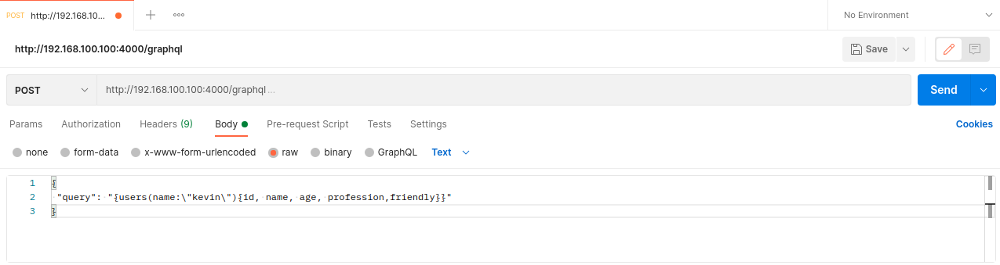

# Overview

This source code originally is taken from example of [Bradford Hamilton github repositories](https://github.com/bradford-hamilton/go-graphql-api/), it is based on [his tutorial in medium](https://medium.com/@bradford_hamilton/building-an-api-with-graphql-and-go-9350df5c9356).
I've changes some third party library use in this example to be align with golang graphql SRIN sharing session, changes are:

- replace chi router with gorilla mux
- added app configuration file for pointing postgres database and log configuration 
- update connection string postgreSQL using password and configuration file (using yaml file)    
- added api log using [logrus](https://github.com/sirupsen/logrus)

# How to build and run

## Preparation
- Assume you already have PostgreSQL server configured and able to access via remotely, or running in same instance in your PC / laptop
- Create database `go_graphql_db` and create table inside PostgreqSQL server with following script:

    ```sql  
    CREATE TABLE users (
      id serial PRIMARY KEY,
      name VARCHAR (50) NOT NULL,
      age INT NOT NULL,
      profession VARCHAR (50) NOT NULL,
      friendly BOOLEAN NOT NULL
    );
    
    INSERT INTO users VALUES
      (1, 'kevin', 35, 'waiter', true),
      (2, 'angela', 21, 'concierge', true),
      (3, 'alex', 26, 'zoo keeper', false),
      (4, 'becky', 67, 'retired', false),
      (5, 'kevin', 15, 'in school', true),
      (6, 'frankie', 45, 'teller', true);
    ```
    make sure database table are accessible with current user PostgreSQL 

- Update [configuration yaml file](app-config.yaml) to set PostgreSQL endpoint, database, user, password and logger using following format:

    ```yaml
    app: #application section
      port: <your available port>
    postgres: #postgresql section
      host: "<postgresql ip>"
      port: <postgresql port>
      dbname: "go_graphql_db"
      user: "<postgresql user>"
      password: "<postgresql password>"
      sslmode: false
    logger: #log section
      filename: "<log file name>"
      format: "text" # log output format can be text or json
      loglevel: 4 # log level 0: panic, 1:fatal, 2:error, 3:warn, 4:info, 5:debug, 6:trace
    ```

    example configuration:
    
    ```yaml
    app: #application section
      port: 4000
    postgres: #postgresql section
      host: "192.168.100.100"
      port: 5432
      dbname: "go_graphql_db"
      user: postgres
      password: postgres
      sslmode: false
    logger: #log section
      filename: "app.log"
      format: "text" # or json
      loglevel: 4 #0: panic, 1:fatal, 2:error, 3:warn, 4:info, 5:debug, 6:trace
    ```

## Build and run

**Note:** 
- Assume you already have set up your Golang environment in linux machine, if not refer to [this](https://golang.org/doc/install) article for setup your Golang environment, example code are written using [Go v1.15.5](https://golang.org/dl/go1.15.5.linux-amd64.tar.gz).
- Put source code inside `$GOPATH/src/<yourAppFolder>`. In this example, we put source code in path `/home/ubuntu/go/src/graphql-api`.
- To get to know where is your GOPATH folder, type in terminal `go env GOPATH`.

Step to build:
- Open terminal. Copy or clone source code into your GOPATH folder. i.e:

    ```shell script
    $ cp -r graphql-api /home/ubuntu/go/src/
    ```

- From terminal, change directory to the `graphql-api` project path, then run command `go mod vendor` and `go mod tidy` then build project using command `go build -o graphql-api`. run it using command `./graphql-api`

    ```shell
    $ cd /home/ubuntu/go/src/graphql-api
    $ go mod vendor # wait until finish
    $ go mod tidy # again, wait until finish
    $ go build -o graphql-api # output is binary graphql-api 
    ```

- Run app. App will be using port 4000 (see [Preparation section](#preparation))

    ``` shell script
    $ ./graphql-api # run it
    ```
- Verified if app is already up and running via log file, in this example log file name is `app.log`, following is example of log output:

    ```shell script
    time="2021-06-14T11:55:40+07:00" level=info msg="Starting graphql http service in port 4000" file="main.go:34" function=initializeAPI
    time="2021-06-14T11:55:40+07:00" level=info msg="Open connection to database with connection string host=192.168.100.100 port=5432 user=postgres dbname=go_graphql_db password=postgres sslmode=disable" file="postgres.go:21" function=New
    time="2021-06-14T11:55:40+07:00" level=info msg="Checking db connection..." file="postgres.go:28" function=New
    time="2021-06-14T11:55:40+07:00" level=info msg="Db Successfully connected" file="postgres.go:34" function=New
    time="2021-06-14T11:55:40+07:00" level=info msg="Construct http handler function" file="server.go:23" function=GraphQL
    ``` 

## Test endpoint

In this example, there is only one endpoint there are `/graphql` using method POST. Do test application using `Postman` or `curl`. In this example we will test it using `Postman`

- body / payload data to submit

    ```json
    {
     "query": "{users(name:\"kevin\"){id, name, age, profession, friendly}}"
    }
    ```
    
    

- output
    
    ```json
    {"data":{"users":[{"age":35,"friendly":true,"id":1,"name":"kevin","profession":"waiter"},{"age":15,"friendly":true,"id":5,"name":"kevin","profession":"in school"}]}}
    ```
    
    
    
- log output
    ```shell script
    .........
    time="2021-06-14T12:09:12+07:00" level=info msg="========== Start Handling Request: /graphql - POST ==========" file="server.go:25" function=func1
    time="2021-06-14T12:09:12+07:00" level=info msg="Check to ensure query was provided in the request body" file="server.go:26" function=func1
    time="2021-06-14T12:09:12+07:00" level=info msg="Graphql execute query {users(name:\"kevin\"){id, name, age, profession,friendly}}" file="gql.go:10" function=ExecuteQuery
    time="2021-06-14T12:09:12+07:00" level=info msg="Get user name kevin from db" file="postgres.go:59" function=GetUsersByName
    time="2021-06-14T12:09:12+07:00" level=info msg="User name kevin found, constructing results..." file="postgres.go:72" function=GetUsersByName
    time="2021-06-14T12:09:12+07:00" level=info msg="Db query results is [{ID:1 Name:kevin Age:35 Profession:waiter Friendly:true} {ID:5 Name:kevin Age:15 Profession:in school Friendly:true}]" file="postgres.go:91" function=GetUsersByName
    time="2021-06-14T12:09:12+07:00" level=info msg="Graphql execute query results &{Data:map[users:[map[age:35 friendly:true id:1 name:kevin profession:waiter] map[age:15 friendly:true id:5 name:kevin profession:in school]]] Errors:[]}" file="gql.go:19" function=ExecuteQuery
    time="2021-06-14T12:09:12+07:00" level=info msg="Writing body response" file="server.go:45" function=func1
    time="2021-06-14T12:09:12+07:00" level=info msg="========== End Handling Request: /graphql - POST ==========" file="server.go:49" function=func1
    ```