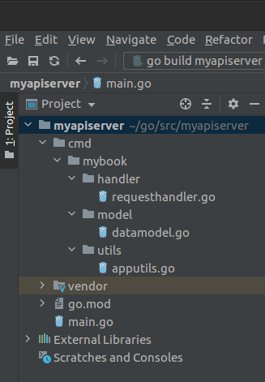
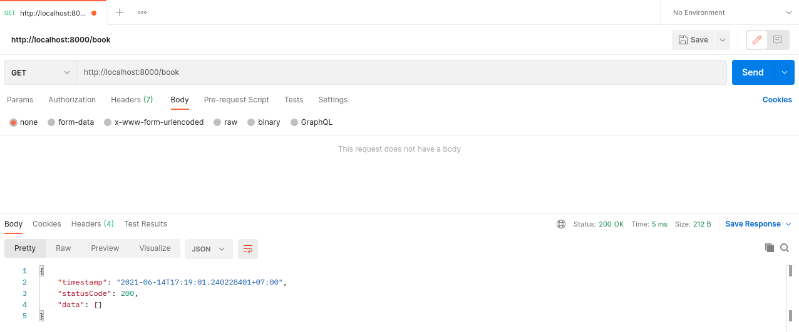
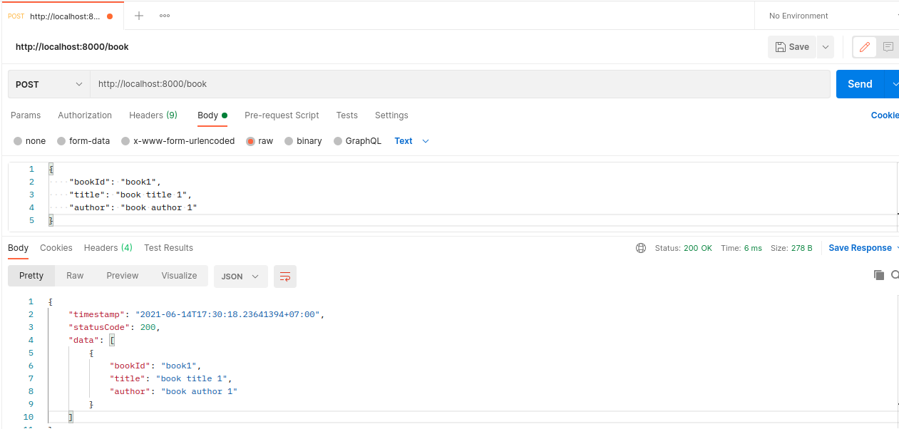
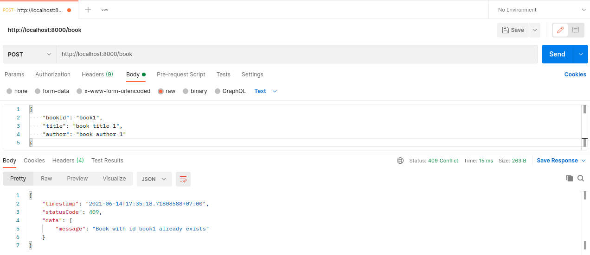
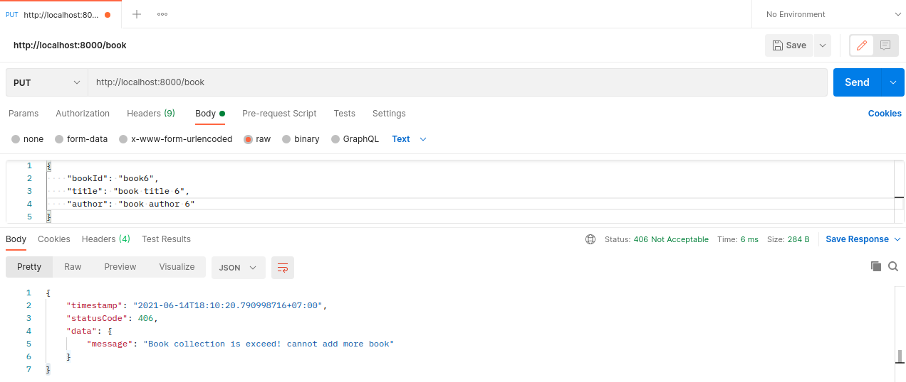
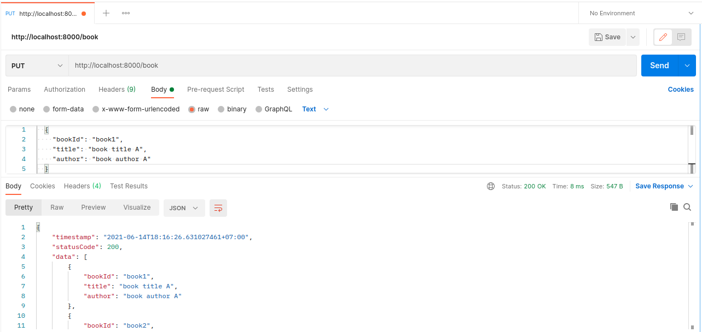
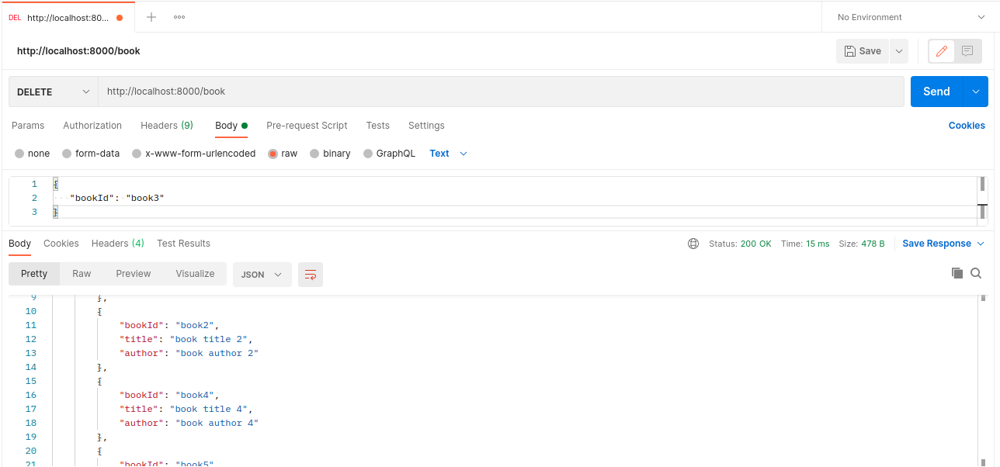

# REST service using third party Gorilla Mux


Package gorilla/mux implements a request router and dispatcher for matching incoming requests to their respective handler. The name mux stands for "HTTP request multiplexer". Like the standard http.ServeMux, mux.Router matches incoming requests against a list of registered routes and calls a handler for the route that matches the URL or other conditions.

The main features are:

- It implements the http.Handler interface so it is compatible with the standard http.ServeMux.
- Requests can be matched based on URL host, path, path prefix, schemes, header and query values, HTTP methods or using custom matchers.
- URL hosts, paths and query values can have variables with an optional regular expression.
- Registered URLs can be built, or "reversed", which helps maintaining references to resources.
- Routes can be used as subrouters: nested routes are only tested if the parent route matches. This is useful to define groups of routes that share common conditions like a host, a path prefix or other repeated attributes.

Gorilla is a web toolkit for Go programming language. Packages inside Gorilla mux are:

- [gorilla/context](https://www.gorillatoolkit.org/pkg/context) stores global request variables.
- [gorilla/mux](https://www.gorillatoolkit.org/pkg/mux) is a powerful URL router and dispatcher.
- [gorilla/reverse](https://www.gorillatoolkit.org/pkg/reverse) produces reversible regular expressions for regexp-based muxes.
- [gorilla/rpc](https://www.gorillatoolkit.org/pkg/rpc) implements RPC over HTTP with codec for JSON-RPC.
- [gorilla/schema](https://www.gorillatoolkit.org/pkg/schema) converts form values to a struct.
- [gorilla/securecookie](https://www.gorillatoolkit.org/pkg/securecookie) encodes and decodes authenticated and optionally encrypted cookie values.
- [gorilla/sessions](https://www.gorillatoolkit.org/pkg/sessions) saves cookie and filesystem sessions and allows custom session backends.
- [gorilla/websocket](https://www.gorillatoolkit.org/pkg/websocket) implements the WebSocket protocol defined in RFC 6455.
- [gorilla/csrf](https://www.gorillatoolkit.org/pkg/csrf) provides Cross Site Request Forgery (CSRF) prevention middleware.
- [gorilla/handlers](https://www.gorillatoolkit.org/pkg/handlers) is a collection of useful handlers for Go's net/http package.

### Use in project

Assume go is already properly configured in development machine, inside project folder type:

```shell
$ go get -u github.com/gorilla/mux
```

### Example using Gorilla Mux REST Server

Here is example REST API service using library Gorilla Mux. In this example, we are using go version `1.15` with linux environment. Try copy paste this code in your favorite editor:

**Note:** 
- Assume you already have setup your Golang environment in linux machine, if not refer to [this](https://golang.org/doc/install) article for setup your Golang environment, example code are written using [Go v1.15.5](https://golang.org/dl/go1.15.5.linux-amd64.tar.gz).
- Put source code inside `$GOPATH/src/<yourAppFolder>`. In this example, we put source code in path `/home/ubuntu/go/src/myrestserver`.
- To get to know where is your GOPATH folder, type in terminal `go env GOPATH`.


```go
/* file: main.go */

package main

import (
   "fmt"
   "github.com/gorilla/mux"
   "log"
   "net/http"
   "time"
)

func main () {
   //create gorilla mux router
   router := mux.NewRouter()

   //define http service options
   srvOptions := &http.Server{
      Addr:         fmt.Sprintf("0.0.0.0:%s", "8000"),
      WriteTimeout: time.Second * 5,
      ReadTimeout:  time.Second * 5,
      IdleTimeout:  time.Second * 5,
      Handler:      router,
   }

   //register handler using different function for each method handler
   router.HandleFunc("/",requestGetHandler).Methods(http.MethodGet)
   router.HandleFunc("/",requestPostHandler).Methods(http.MethodPost)
   router.HandleFunc("/",requestPutHandler).Methods(http.MethodPut)
   router.HandleFunc("/",requestDeleteHandler).Methods(http.MethodDelete)

   //start server
   log.Fatal(srvOptions.ListenAndServe())
}

//handler get method
func requestGetHandler(w http.ResponseWriter, r *http.Request) {
   message := "Done handling method GET"
   w.WriteHeader(http.StatusOK)
   w.Write([]byte(message))
}

//handler post method
func requestPostHandler(w http.ResponseWriter, r *http.Request) {
   message := "Done handling method POST"
   w.WriteHeader(http.StatusOK)
   w.Write([]byte(message))
}

//handler put method
func requestPutHandler(w http.ResponseWriter, r *http.Request) {
   message := "Done handling method PUT"
   w.WriteHeader(http.StatusOK)
   w.Write([]byte(message))
}

//handler delete method
func requestDeleteHandler(w http.ResponseWriter, r *http.Request) {
   message := "Done handling method DELETE"
   w.WriteHeader(http.StatusOK)
   w.Write([]byte(message))
}
```


Build source code using command :

```shell
$ go mod init # initialize go modules, skip this step if already done previously
$ go mod vendor # downloading dependencies third party modules
$ go mod tidy # clean up unused dependencies if any 
$ go build -o myrestserver
$ ./myrestserver # run app
```

Open your browser, and point url to [http://localhost:8000](http://localhost:8000). If app running successfully, it will show as image below:


Or you can used `curl` for testing. Step is same as in testing updated `requestHandler` using `curl` in section **Standard Library REST Service (Native)**

Explanation:

1. Package and import

   ```go
   package main

   import (
      "fmt"
      "github.com/gorilla/mux"
      "log"
      "net/http"
      "time"
   )
   ```

   Package name in this example is using name main, this is used as main package of golang application. Standard library used is fmt, log, net/http, and time. We also import third party `github.com/gorilla/mux` for REST API library.

2. Function main

   ```go
   func main () {

      //create gorilla mux router
      router := mux.NewRouter()

      //define http service options
      srvOptions := &http.Server{
         Addr:         fmt.Sprintf("0.0.0.0:%s", "8000"),
         WriteTimeout: time.Second * 5,
         ReadTimeout:  time.Second * 5,
         IdleTimeout:  time.Second * 5,
         Handler:      router,
      }

      //register handler using different function for each method handler
      router.HandleFunc("/",requestGetHandler).Methods(http.MethodGet)
      router.HandleFunc("/",requestPostHandler).Methods(http.MethodPost)
      router.HandleFunc("/",requestPutHandler).Methods(http.MethodPut)
      router.HandleFunc("/",requestDeleteHandler).Methods(http.MethodDelete)

      //start server
      log.Fatal(srvOptions.ListenAndServe())
   }
   ```
   inside function main, there are 4 section need to initialize:
   - create gorilla mux router
   
     ```go
      //create gorilla mux router
      router := mux.NewRouter()
     ```
     
     by calling function `mux.NewRouter()`, this will initialize `router` variable with Gorilla mux router

   - define http service options

     ```go
      //define http service options
      srvOptions := &http.Server{
         Addr:         fmt.Sprintf("0.0.0.0:%s", "8000"),
         WriteTimeout: time.Second * 5,
         ReadTimeout:  time.Second * 5,
         IdleTimeout:  time.Second * 5,
         Handler:      router,
      }
     ```

      it is used to configure REST API server behavior. Options are based on native `net/http` packages, for more details refer to [this](https://pkg.go.dev/net/http#pkg-overview) article and search `http.server`. There are:

      - `Addr` for listening ip address
      - `WriteTimeout` write timeout for incoming request
      - `ReadTimeout` for read timeout incoming request
      - `IdleTimeout` for idle timeout incoming request
      - `Handler` for set handler request into Gorilla mux router.

   - register handler
   
     ```go
      //register handler using different function for each method handler
      router.HandleFunc("/",requestGetHandler).Methods(http.MethodGet)
      router.HandleFunc("/",requestPostHandler).Methods(http.MethodPost)
      router.HandleFunc("/",requestPutHandler).Methods(http.MethodPut)
      router.HandleFunc("/",requestDeleteHandler).Methods(http.MethodDelete)
     ```
   
   - start server
     ```go
     //start server
     log.Fatal(srvOptions.ListenAndServe())
     ```
   
     Start server from variable `srvOptions`

3. Function request handler

   ```go
   //handler get method
   func requestGetHandler(w http.ResponseWriter, r *http.Request) {
      message := "Done handling method GET"
      w.WriteHeader(http.StatusOK)
      w.Write([]byte(message))
   }

   //handler post method
   func requestPostHandler(w http.ResponseWriter, r *http.Request) {
      message := "Done handling method POST"
      w.WriteHeader(http.StatusOK)
      w.Write([]byte(message))
   }

   //handler put method
   func requestPutHandler(w http.ResponseWriter, r *http.Request) {
      message := "Done handling method PUT"
      w.WriteHeader(http.StatusOK)
      w.Write([]byte(message))
   }

   //handler delete method
   func requestDeleteHandler(w http.ResponseWriter, r *http.Request) {
      message := "Done handling method DELETE"
      w.WriteHeader(http.StatusOK)
      w.Write([]byte(message))
   }
   ```
   In this example, each handler contains same code, which is only sending static message based on value in variable `message` with http response code 200.

## More example app - Book Collection REST Service

### Overview

This is example app of Book Collection REST Service using Gorilla mux library, limited to 5 book only (stored in slice). It is intended to give better understanding on how to handle request with body data / payload using json string, handling error, and send response success and error with json body data / payload. Full source code can be download [here](code/myapiserver.tar.gz).

After successfully download, extract source code and move it to `GOPATH/src` folder. Make sure `src` folder is exists, if not exists create it first, let say GOPATH is `/home/ubuntu/go` :

```shell
   $ tar -zxvf myapiserver.tar.gz
   $ mv myapiserver /home/ubuntu/go/src
```

Open project folder from your favorite editor. As this article is written I'm using [Goland](https://www.jetbrains.com/go/download/#section=linux) as IDE for Golang. Project structure should be shown as in below images



In this project, there are four packages. Each package contain one `.go` file :
- `main`, main project packages (file: main.go)
- `handler`, REST API service request handler (file: requesthandler.go)
- `model`, data model (file: datamodel.go)
- `utils`, app utility (file: apputils.go)


### Build, run and test

From terminal, change directory to the `myapiserver` project path, then run command `go mod vendor` and `go mod tidy` then build project using command `go build -o myapiserver`. run it using command `./myapiserver`

```shell
   $ cd /home/ubuntu/go/src/myapiserver
   $ go mod vendor # wait until finish
   $ go mod tidy # again, wait until finish
   $ go build -o myapiserver # output is binary myapiserver 
   $ ./myapiserver # run it
```

Book Collection app only have two endpoint REST service with supported method GET, POST, PUT, DELETE. Here is API specification in this example app:

- Endpoint `/book`:

	| Method | Http Success code | Http Error Code      |
	|--------|-------------------|----------------------|
	| GET    | 200 (ok)          | -                    |
	| POST   | 200 (ok)          | 409 (conflict)       |
	|        |                   | 406 (not acceptable) |
	| PUT    | 200 (ok)          | 406 (not acceptable) |
	| DELETE | 200 (ok)          | 410 (gone)           |

- Endpoint `/book/{id}`

	| Method | Http Success code | Http Error Code      |
	|--------|-------------------|----------------------|
	| GET    | 200 (ok)          | 400 (bad request)    |

When first time app run, slice will be empty, so, if we send request to endpoint `/book` using method GET, it will return only basic response template with empty slice data.

Here is test result using Postman for each method:

- Endpoint `/book` method GET (read data)
  
  
  
  This is first time app run, so it will only send template response with empty slice data.
  structure of base template response are:

  ```json
  {
    "timestamp": "<showing timestamp of response in string>",
    "statusCode": <http response code>,
    "data": <the body data>
  }
  ```

  in this example, if is empty, it will response as following

  ```json
  {
    "timestamp": "2021-06-14T17:19:01.240228401+07:00",
    "statusCode": 200,
    "data": []
  }
  ```

- Endpoint `/book` method POST (insert data)
  
  in this test we will send request using data / payload as following:

  ```json
  {
    "bookId": "book1",
    "title": "book title 1",
    "author": "book author 1"
  }
  ```

  

  response of this method are showing list of available book inside slice, response data will be put inside basic template response into attribute `data`, see image above. How about if we send another request but using same request data / payload:

  
  
  response is showing error message with response status 409 (conflict).
  
  Lets continue adding more book with the following payload in sequentially one by one:

  data book 2:

  ```json
  {
    "bookId": "book2",
    "title": "book title 2",
    "author": "book author 2"
  }
  ```

  data book 3:

  ```json
  {
    "bookId": "book3",
    "title": "book title 3",
    "author": "book author 3"
  }
  ```

  data book 4:

  ```json
  {
    "bookId": "book4",
    "title": "book title 4",
    "author": "book author 4"
  }
  ```

  data book 5:

  ```json
  {
    "bookId": "book5",
    "title": "book title 5",
    "author": "book author 5"
  }
  ```
  
  and, finally add another book, with id book6,
  data book 6:

  ```json
  {
    "bookId": "book6",
    "title": "book title 6",
    "author": "book author 6"
  }
  ```

  Is data for `book6` able to insert ?, of course not. This is because we put limitation only for five data inside book slice. Here is result last book6 post request in Postman:

  
  

  Pay attention for each response in this method POST. In each response result, value inside attribute `data` has diffrent values and also `statusCode` attribute is differents, but still using same base template:


	body response success
	```json
	{
		"timestamp": "2021-06-14T17:50:32.803882454+07:00",
		"statusCode": 200,
		"data": [
			{
				"bookId": "book1",
				"title": "book title 1",
				"author": "book author 1"
			}
		]
	}
	```

	body response error, book already exists:
	```json
	{
		"timestamp": "2021-06-14T17:35:18.71808588+07:00",
		"statusCode": 409,
		"data": {
			"message": "Book with id book1 already exists"
		}
	}
	```

	body response error, book slice exceed:
	```json
	{
		"timestamp": "2021-06-14T18:10:20.790998716+07:00",
		"statusCode": 406,
		"data": {
			"message": "Book collection is exceed! cannot add more book"
		}
	}
	```
  
- Endpoint `/book` method PUT (update data)
  
  In this test, we will update existing data. Lets continue based on existing data in our previous example. Currently, there is only five book inside slice. We are going to change value book title and book author only for book with id `book1`. Prepare payload as following:

  ```json
  {
    "bookId": "book1",
    "title": "book title A",
    "author": "book author A"
  }
  ```
  
  send request using postman as following:

  

  response body:

  ```json
	{
		"timestamp": "2021-06-14T18:16:26.631027461+07:00",
		"statusCode": 200,
		"data": [
			{
				"bookId": "book1",
				"title": "book title A",
				"author": "book author A"
			},
			{
				"bookId": "book2",
				"title": "book title 2",
				"author": "book author 2"
			},
			{
				"bookId": "book3",
				"title": "book title 3",
				"author": "book author 3"
			},
			{
				"bookId": "book4",
				"title": "book title 4",
				"author": "book author 4"
			},
			{
				"bookId": "book5",
				"title": "book title 5",
				"author": "book author 5"
			}
		]
	}
  ```

- Endpoint `/book` method DELETE (delete data)
  
  Now we have 5 book inside our slice, let say we want to remove some book which is book with id `book3`, prepare request body as following:
  
  ```json
  {
    "bookId": "book3"
  }
  ```
  
  send request using postman as following:

  

  response body:

  ```json
	{
		"timestamp": "2021-06-14T18:21:18.2862175+07:00",
		"statusCode": 200,
		"data": [
			{
				"bookId": "book1",
				"title": "book title A",
				"author": "book author A"
			},
			{
				"bookId": "book2",
				"title": "book title 2",
				"author": "book author 2"
			},
			{
				"bookId": "book4",
				"title": "book title 4",
				"author": "book author 4"
			},
			{
				"bookId": "book5",
				"title": "book title 5",
				"author": "book author 5"
			}
		]
	}
  ```
 
  as listed in response body, book with id `book3` is already removed.

- Endpoint `/book/{id}` method GET (read data by specific id)
 
  In some case, we want to get information about specific book, let say we know the book id and we'd like to query it and showing the title and author. We can use another endpoint in this example, it is using endpoint `/book/{id}`. `{id}` is stands for book id inputted into URL request query. 
  
  For example, we want to get data for book with id `book2`, so, url request will be `http://localhost:8000/book/book2`

  

### Source code

Here is source code from each file:

- file: main.go

```go
package main

import (
	"fmt"
	"github.com/gorilla/mux"
	"log"
	"myapiserver/cmd/mybook/handler"
	"net/http"
	"time"
)

func main () {

	//create gorilla mux router
	router := mux.NewRouter()

	//define http service options
	srvOptions := &http.Server{
		Addr:         fmt.Sprintf("0.0.0.0:%s", "8000"),
		WriteTimeout: time.Second * 5,
		ReadTimeout:  time.Second * 5,
		IdleTimeout:  time.Second * 5,
		Handler:      router,
	}

	//register handler
	router.HandleFunc("/book",handler.RequestGetHandler).Methods(http.MethodGet)
	router.HandleFunc("/book/{bookid}",handler.RequestGetParamHandler).Methods(http.MethodGet)
	router.HandleFunc("/book",handler.RequestPostHandler).Methods(http.MethodPost)
	router.HandleFunc("/book",handler.RequestPutHandler).Methods(http.MethodPut)
	router.HandleFunc("/book",handler.RequestDeleteHandler).Methods(http.MethodDelete)

	//start server
	log.Fatal(srvOptions.ListenAndServe())
}
```

- file: requesthandler.go

```go
package handler

import (
	"encoding/json"
	"fmt"
	"github.com/gorilla/mux"
	"myapiserver/cmd/mybook/model"
	"myapiserver/cmd/mybook/utils"
	"net/http"
	"strconv"
	"time"
)

//limit book to keep
const TotalBookRows = 5

//book collection place holder, need to initialize
var bookCollection = make([]model.MyBook, 0)

func RequestHandler(w http.ResponseWriter, r *http.Request) {
	switch r.Method {
	case http.MethodGet :
		RequestGetHandler(w, r)
	case http.MethodPost:
		RequestPostHandler(w, r)
	case http.MethodPut :
		RequestPutHandler(w, r)
	case http.MethodDelete:
		RequestDeleteHandler(w, r)
	}
}

//handler get method
func RequestGetHandler(w http.ResponseWriter, r *http.Request) {
	fmt.Printf("receive request with method:  %s\n", r.Method)
	fmt.Printf("requester address: %s\n",r.RemoteAddr)

	//send response success
	responseWriter(w, http.StatusOK, bookCollection)

	fmt.Printf("done handling request %s\n", r.Method)
}

//handler get method with bookid param
func RequestGetParamHandler(w http.ResponseWriter, r *http.Request) {
	fmt.Printf("receive request with method:  %s using bookid parameter\n", r.Method)
	fmt.Printf("requester address: %s\n",r.RemoteAddr)

	vars := mux.Vars(r)
	bookid := vars["bookid"]
	book, _ := utils.SearchBook(bookid, bookCollection)
	if book != nil {
		responseWriter(w, http.StatusOK, book)
	} else {
		errBody := model.ErrorResponse{
			ErrorMsg: fmt.Sprintf("Book with id %s not found", bookid),
		}
		responseWriter(w, http.StatusBadRequest, errBody)
	}

	fmt.Printf("done handling request %s\n", r.Method)
}

//handler post method
func RequestPostHandler(w http.ResponseWriter, r *http.Request) {
	fmt.Printf("receive request with method:  %s\n", r.Method)
	fmt.Printf("requester address: %s\n",r.RemoteAddr)

	//convert body request into request struct book data model
	var requestDataModel model.MyBook
	jsonDecoder := json.NewDecoder(r.Body)
	err := jsonDecoder.Decode(&requestDataModel)
	if err != nil {
		fmt.Printf("failed to decode json request body: %+v\n", err)
		panic(err)
	}
	fmt.Printf("successfully decode json request body into struct \n")

	//verify if book already exist or not
	book, _ := utils.SearchBook(requestDataModel.BookId, bookCollection)

	if book != nil {
		//build error body response
		errBody := model.ErrorResponse{
			ErrorMsg: fmt.Sprintf("Book with id %s already exists", requestDataModel.BookId),
		}
		//send response error
		responseWriter(w, http.StatusConflict, errBody)
		return //force return to make sure code below not executed
	}

	//build json response payload
	if len(bookCollection) < TotalBookRows { //build success response
		bookCollection = append(bookCollection, requestDataModel)

		//send response success
		responseWriter(w, http.StatusOK, bookCollection)
	} else { //build error response

		//build error body response
		errBody := model.ErrorResponse{
			ErrorMsg: "Book collection is exceed! cannot add more book",
		}

		//send response error
		responseWriter(w, http.StatusNotAcceptable, errBody)
	}
	fmt.Printf("done handling request %s\n", r.Method)
}

//handler put method
func RequestPutHandler(w http.ResponseWriter, r *http.Request) {
	fmt.Printf("receive request with method:  %s\n", r.Method)
	fmt.Printf("requester address: %s\n",r.RemoteAddr)

	//convert body request into request struct book data model
	var requestDataModel model.MyBook
	jsonDecoder := json.NewDecoder(r.Body)
	err := jsonDecoder.Decode(&requestDataModel)
	if err != nil {
		fmt.Printf("failed to decode json request body: %+v\n", err)
		panic(err)
	}
	fmt.Printf("successfully decode json request body into struct \n")

	//check if book already exists or not, if exist then update else append to bookCollection
	book, idx := utils.SearchBook(requestDataModel.BookId, bookCollection)

	//verifying book collection space
	if len(bookCollection) < TotalBookRows {
		if book == nil { // book not exists, then append it to collection
			bookCollection = append(bookCollection, requestDataModel)
		} else {
			//book found, then update book collection info
			bookCollection[idx].Title = requestDataModel.Title
			bookCollection[idx].Author = requestDataModel.Author
		}

		//send response success
		responseWriter(w, http.StatusOK, bookCollection)

	} else if len(bookCollection) == TotalBookRows {
		if book == nil {
			//book not exists, we want to append it into collection
			//but there is no more space to keep book, then return error response
			//build error body response
			errBody := model.ErrorResponse{
				ErrorMsg: "Book collection is exceed! cannot add more book",
			}

			//send response error
			responseWriter(w, http.StatusNotAcceptable, errBody)
			fmt.Printf("done handling request %s", r.Method)
			return //must call return, if not code below will be executed
		}

		//book found, then update book collection info
		bookCollection[idx].Title = requestDataModel.Title
		bookCollection[idx].Author = requestDataModel.Author

		//send response success
		responseWriter(w, http.StatusOK, bookCollection)
	}
	fmt.Printf("done handling request %s\n", r.Method)
}

//handler delete method
func RequestDeleteHandler(w http.ResponseWriter, r *http.Request) {
	fmt.Printf("receive request with method:  %s\n", r.Method)
	fmt.Printf("requester address: %s\n",r.RemoteAddr)

	//convert body request into request struct book data model
	var requestDataModel model.MyBook
	jsonDecoder := json.NewDecoder(r.Body)
	err := jsonDecoder.Decode(&requestDataModel)
	if err != nil {
		fmt.Printf("failed to decode json request body: %+v\n", err)
		panic(err)
	}
	fmt.Printf("successfully decode json request body into struct \n")

	//search and remove from book index collection
	book, idx := utils.SearchBook(requestDataModel.BookId, bookCollection)

	if book == nil { //not found
		//build error body response
		errBody := model.ErrorResponse{
			ErrorMsg: fmt.Sprintf("Book id %s not found or is already deleted", requestDataModel.BookId),
		}

		//send response error
		responseWriter(w, http.StatusGone, errBody)
		fmt.Printf("done handling request %s", r.Method)
	} else { // found target for remove index
		//rebuild slice except index in "idx" variable
		bookCollection = append(bookCollection[:idx], bookCollection[idx+1:]...)

		//send response success
		responseWriter(w, http.StatusOK, bookCollection)
	}
	fmt.Printf("done handling request %s\n", r.Method)
}

//response builder using APIResponse template
func responseWriter(w http.ResponseWriter, statusCode int, data interface{}) ([]byte, int) {

	//set desired header, it is optional to set
	w.Header().Set("Content-type","application/json")                          //optional
	w.Header().Set("Total-book-collection", strconv.Itoa(len(bookCollection))) //optional

	//set http response code
	w.WriteHeader(statusCode)

	//build response body template and pass data value
	responseTemplate := model.APIResponse{
		Timestamp : time.Now(),
		StatusCode : statusCode,
		Data : data,
	}

	//write to requester
	if data != nil {
		jsonResponseByte, _ := json.Marshal(responseTemplate)
		fmt.Printf("sending json response : %s\n", string(jsonResponseByte))
		w.Write(jsonResponseByte)
		return jsonResponseByte, statusCode
	} else {
		fmt.Println("sending empty body response")
		w.Write(nil)
		return nil, statusCode
	}

}
```

- file: datamodel.go

```go
package model

import "time"

//json for error response
type ErrorResponse struct {
	ErrorMsg string `json:"message"`
}

//book data to keep
type MyBook struct {
	BookId string `json:"bookId"`
	Title string `json:"title"`
	Author string `json:"author"`
}

//base API template structure
type APIResponse struct {
	Timestamp  time.Time   `json:"timestamp"`
	StatusCode int         `json:"statusCode"`
	Data       interface{} `json:"data"`  // value in this field is accept any type of data
}
```

- file: apputils.go

```go
package utils

import (
	"myapiserver/cmd/mybook/model"
	"strings"
)

func SearchBook(bookId string, bookCollection []model.MyBook) (book *model.MyBook, index int) {
	for idx, book := range bookCollection {
		if strings.Compare(bookId, book.BookId) == 0 {
			return &book, idx
		}
	}
	return nil, -1
}
```