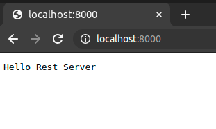

# REST service using Golang Standard Library

Golang have native packages for handling http rest server. It is using package [net/http](https://pkg.go.dev/net/http).

Package `net/http` provide HTTP client and server implementations. For more details about available function in package please refer to [this](https://pkg.go.dev/net/http#pkg-index) article.

### Example using Golang native code REST Server
Here is example of REST server write in Go. Try below code, you can copy paste into your favorite editor:


**Note:** 
- Assume you already have setup your Golang environment in linux machine, if not refer to [this](https://golang.org/doc/install) article for setup your Golang environment, example code are written using [Go v1.15.5](https://golang.org/dl/go1.15.5.linux-amd64.tar.gz).
- Put source code inside `$GOPATH/src/<yourAppFolder>`. In this example, we put source code in path `/home/ubuntu/go/src/myrestserver`.
- To get to know where is your GOPATH folder, type in terminal `go env GOPATH`.


```go
/* file : main.go */

package main

import (
   "fmt"
   "log"
   "net/http"
)

func main() {
   //multiple method handle in a function
   //handled method: GET, POST, PUT, DELETE
   http.HandleFunc("/", requestHandler)

   //run server, using port 8000 
   //or change it to what ever port number available
   log.Fatal(http.ListenAndServe(":8000",nil))
}

func requestHandler(w http.ResponseWriter, r *http.Request) {
   fmt.Printf("handle request %s\n", r.Method )
   message := "Hello Rest Server"
   w.WriteHeader(http.StatusOK)
   w.Write([]byte(message))
}
```

then compile it using command `go build -o myrestserver`, it will produce binary with name `myrestserver`. Run it using command `./myrestserver`. Open your browser and point url to [http://localhost:8000](http://localhost:8000). If is run as expected, your browser will show as image:



Explanation:

1. Package and import

   ```go
   package main

   import (
      "fmt"
      "log"
      "net/http"
   )
   ```

   Package name in this example is using name `main`, this is used as main package of golang application. Standard library used is [fmt](https://golang.org/pkg/fmt/), [log](https://golang.org/pkg/log/) and [net/http](https://pkg.go.dev/net/http).

2. Function main
   ```go
   func main() {
      //multiple method handle in a function
      //handled method: GET, POST, PUT, DELETE
      http.HandleFunc("/", requestHandler)

      //run server, using port 8000 
      //or change it to what ever port number available
      log.Fatal(http.ListenAndServe(":8000",nil))
   }
   ```
   Inside this function there is function call to [http.HandleFunc](https://pkg.go.dev/net/http#HandleFunc), this is use for registering REST service endpoint handler. In this example we are registering endpoint `/` with function `requestHandler` to handle incoming request to the path.

   ```go
	//multiple method handle in a function
	//handled method: GET, POST, PUT, DELETE
	http.HandleFunc("/", requestHandler)
   ```

   To start server, call function [http.ListenAndServe](https://pkg.go.dev/net/http#ListenAndServe). It is required to define port number to be used in application, in this example we are using port 8000

   ```go
   //run server, using port 8000 
   //or change it to what ever port number available
	log.Fatal(http.ListenAndServe(":8000",nil))
   ```

3. Function requestHandler
   ```go
   func requestHandler(w http.ResponseWriter, r *http.Request) {
      fmt.Printf("handle request %s\n", r.Method )
      message := "Hello Rest Server"
      w.WriteHeader(http.StatusOK)
      w.Write([]byte(message))
   }   
   ```
   This function is use for handle incoming request to the endpoint `/` with **any** method (GET, POST, PUT, DELETE, etc...). For every incoming request:
      - print to stdout using `fmt` with message `handle request <request method name>`. i.e: `handle request GET`
        ```go
        fmt.Printf("handle request %s\n", r.Method )
        ```
      - reply back to requester with response body in `message` variable
        ```go
        message := "Hello Rest Server"
        w.Write([]byte(message)) //send response with body message
        ```

By using Golang native rest service, every incoming request using any method will be handle by `requestHandler`, so, it is required to define specific handler for each method if endpoint is serving multiple method. Here is example for handling specific request method. Updated function `requestHandler`:

```go
func requestHandler(w http.ResponseWriter, r *http.Request) {
   switch r.Method {
      case http.MethodGet :
         //do handle request method GET
         message := "Done handling method GET"
         w.WriteHeader(http.StatusOK)
         w.Write([]byte(message)) //send response with body message  
      case http.MethodPost:
         //do handle request method POST
         message := "Done handling method POST"
         w.WriteHeader(http.StatusOK)
         w.Write([]byte(message)) //send response with body message
      case http.MethodPut :
         //do handle request method PUT
         message := "Done handling method PUT"
         w.WriteHeader(http.StatusOK)
         w.Write([]byte(message)) //send response with body message
      case http.MethodDelete:
         //do handle request method DELETE
         message := "Done handling method DELETE"
         w.WriteHeader(http.StatusOK)
         w.Write([]byte(message)) //send response with body message
      }
}
```

Compile source code and rerun app. Result after updated `requestHandler` are as below, test using `curl`:

- curl with GET method
  
  ```shell
  $ curl -XGET http://localhost:8000
  ```
  
  output:
  
  ```shell
  Done handling method GET
  ```
  
- curl with POST method

  ```shell
  $ curl -XPOST http://localhost:8000
  ```

  output:

  ```shell
  Done handling method POST
  ```

- curl with PUT method

  ```shell
  $ curl -XPUT http://localhost:8000
  ```

  output:

  ```shell
  Done handling method PUT
  ```

- curl with DELETE method

  ```shell
  $ curl -XDELETE http://localhost:8000
  ```

  output:

  ```shell
  Done handling method DELETE
  ```
The built-in `net/http` package is sufficient to build a complete REST API. However, some of the libraries can make building an API slightly easier, particularly if the REST API is complex. 

There is many third party library can be used for building REST API. In our project (Gage gateway / MinIO) we use [Gorilla Mux](https://github.com/gorilla/mux) toolkit to build REST API service. Basically, Gorilla Mux is extention from native packages `net/http` but with more enhance features.

